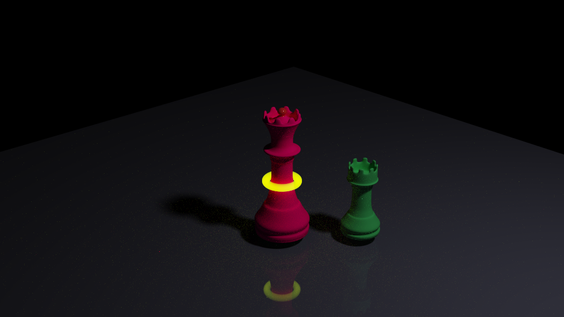
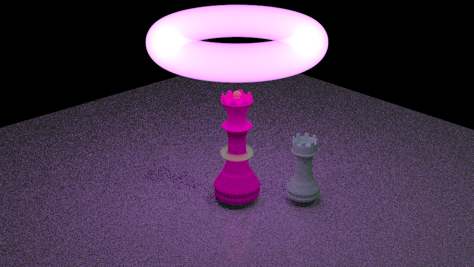

# La Jolla Glow Discharge Renderer

This is a minimal standalone clone of La Jolla Renderer for rendering Glow Discharge


## What is required

This repo builds the image of Queen with Glow Discharge effect.




## Run

First, install/add embree files from your own lajolla renderer (Imp), then:

From the repo root (on Apple silicon, for others you can copy the src code and compile on your own):

```sh
./build/lajolla scenes/queen_scene2.xml -o queen_scene2.exr
```

You can also run it from inside `build/`:

```sh
./lajolla ../scenes/queen_scene2.xml -o queen_scene2.exr
```
